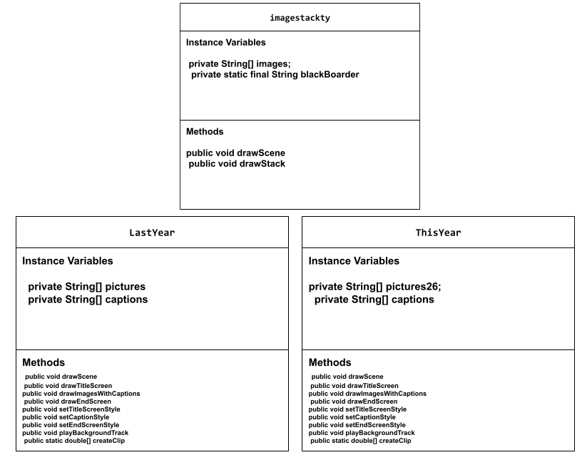

# Project: New Scene, New Me

## Introduction

Software engineers develop programs to create visual and audio experiences using object-oriented programming. As we begin 2026, your goal is to create an animation program that reflects on your experiences from 2025 and visualizes your goals and aspirations for the year ahead using the Theater and Scene API.

## Requirements

Use your knowledge of object-oriented programming, one-dimensional (1D) arrays, algorithms, and the Theater/Scene API to create your animation program:
- **Write Scene subclasses** – Create two Scene subclasses: one to visualize your 2025 recap (LastYear) and another to project your 2026 goals (ThisYear). Each class must include both a no-argument constructor and a parameterized constructor.
- **Use private instance variables** – Implement proper encapsulation by declaring instance variables as private in your Scene subclasses.
- **Create 1D arrays** – Create at least two 1D arrays to store data for your scenes. One array must be created using an initializer list, and one array must be populated by reading from a text file using the FileReader class.
- **Write a method** – Write a method that finds or manipulates the elements in a 1D array to provide the information your user needs.
- **Access and modify array elements** – Use algorithms to traverse, access, and/or modify elements in your 1D arrays to display personalized content in your scenes.
- **Use logic and iteration** – Incorporate selection statements (if/if-else) and loops (while, for, or enhanced for) to control the flow and display of content in your scenes.
Incorporate variety of media – Use at least four different types of Scene API methods across both scenes (examples: drawImage(), drawText(), drawRectangle(), drawEllipse(), playSound(), setTextStyle(), setFillColor(), etc.).
- **Create a UML diagram** – Design a UML class diagram showing your Scene subclasses with their instance variables, constructors, and methods before you begin coding.
- **Document your code** – Use multi-line comments to explain the purpose of each method (including preconditions and postconditions) and single-line comments to explain code segments.

## UML Diagram  

 

## Description of 2025 recap

In my 2025 recap or my last year screen. I included pictures from every season. I included spring where I had various events including easter. I included summer where I had many pictures of beaches and pools. I had fall which involved my freinds and school sports along with some cultural events images. Finally, I had winter which has my sweet sixteen, christmas trees, senior night for my sport, and my trip to death valley; zion; and vegas. 

## Description of 2026 goals

In my 2026 goals I first featured an image stack of things I want to get accomplished. This includes reading more, getting good grades and studying, improving my baking skills and bible studying more. Then for my this year scene I included multiple bible verses or qoutes, this is to showcase one of my most important goals of this year which is deepening my faith and growing as a better person this year. 

## Scene API Usage

I was able to use all the various scene API methods in my code as I was able to use the theater API in order to effectively code and create a video. To this video I was able to use techniques to add background music to make it more engaging and I was able to code the screens in a consective order to create the video how I wanted to by creating different screens for different things. 